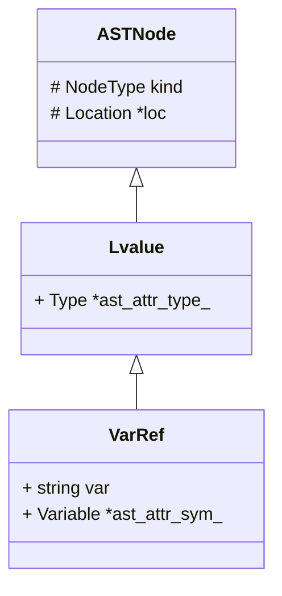

# STAGE2: 变量和语句 实验报告

<center>邢竞择 2020012890</center>

## Step 5

### 实验内容

支持变量的声明、读取、赋值

#### 框架分析



#### 前端
在 `Expr`中添加

```cpp
          | IDENTIFIER
              { $$ = new ast::LvalueExpr(new ast::VarRef($1, POS(@1)), POS(@1)); }
          | IDENTIFIER ASSIGN Expr
              { $$ = new ast::AssignExpr(new ast::VarRef($1, POS(@1)), $3, POS(@2)); }
```

新建`Decl`，并添加

```cpp
Decl        : Type IDENTIFIER SEMICOLON
                { $$ = new ast::VarDecl($2, $1, POS(@2)); }
            | Type IDENTIFIER ASSIGN Expr SEMICOLON
                { $$ = new ast::VarDecl($2, $1, $4, POS(@2)); }
```

#### 中端

在`SemPass1`的`visit`函数中，添加对变量定义冲突的检查，即：在`scope`中查找变量名，若结果非空则有冲突

```cpp
void SemPass1::visit(ast::VarDecl *vdecl) {
    Type *t = NULL;

    vdecl->type->accept(this);
    t = vdecl->type->ATTR(type);

    Variable *v = new Variable(vdecl->name, t, vdecl->getLocation());
    Symbol *sym = scopes->lookup(vdecl->name, vdecl->getLocation(), false);
    if (sym != NULL)
        issue(vdecl->getLocation(), new DeclConflictError(vdecl->name, sym));
    else {
        scopes->declare(v);
        vdecl->ATTR(sym) = v;
        if (vdecl->init != NULL)
            vdecl->init->accept(this);
    }
}
```

在`SemPass2`中，已经包含了从变量定义到诸表达式的类型推断

在`Translation`中，添加生成三地址码的`visit`函数

```cpp
void Translation::visit(ast::AssignExpr *s) {
    // TODO
    s->left->accept(this);
    s->e->accept(this);
    tr->genAssign(((ast::VarRef *)s->left)->ATTR(sym)->getTemp(), s->e->ATTR(val));
    s->ATTR(val) = ((ast::VarRef *)s->left)->ATTR(sym)->getTemp();
}

void Translation::visit(ast::LvalueExpr *e) {
    // TODO
    e->lvalue->accept(this);
    e->ATTR(val) = ((ast::VarRef *)e->lvalue)->ATTR(sym)->getTemp();
}

void Translation::visit(ast::VarRef *ref) {
    switch (ref->ATTR(lv_kind)) {
    case ast::Lvalue::SIMPLE_VAR:
        break;
    default:
        mind_assert(false);
    }
}

void Translation::visit(ast::VarDecl *decl) {
    decl->ATTR(sym)->attachTemp(tr->getNewTempI4());
    // the `init` Expr is allowed to use the new-declared symbol
    if (decl->init != NULL)
        decl->init->accept(this);
    if (decl->init != NULL)
        tr->genAssign(decl->ATTR(sym)->getTemp(), decl->init->ATTR(val));
}
```

#### 后端

对于`Tac::ASSIGN`，添加相应的翻译函数

```cpp
void RiscvDesc::emitTac(Tac *t) {
    ...
    case Tac::ASSIGN:
        emitAssignTac(t);
        break;
    ...
}

void RiscvDesc::emitAssignTac(Tac *t) {
    // eliminates useless assignments
    if (!t->LiveOut->contains(t->op0.var))
        return;
    int r1 = getRegForRead(t->op1.var, 0, t->LiveOut);
    int r0 = getRegForWrite(t->op0.var, r1, 0, t->LiveOut);
    addInstr(RiscvInstr::MOVE, _reg[r0], _reg[r1], NULL, 0, EMPTY_STR, NULL);
}
```


### 思考题

#### 1

```ass
addi sp, sp, -16
```

#### 2

+ 支持在`scope`中修改一个变量名对应的`Symbol`类
+ 在`SemPass2`中，在`VarDecl`节点动态地更新变量名对应的`Symbol`

## Step 6

### 实验内容

#### 中端

在类型检查中，要求`IfExpr`两侧的表达式类型相同

```cpp
void SemPass2::visit(ast::IfExpr *s) {
    s->condition->accept(this);
    if (!s->condition->ATTR(type)->equal(BaseType::Int)) {
        issue(s->condition->getLocation(), new BadTestExprError());
        ;
    }
    s->true_brch->accept(this);
    s->false_brch->accept(this);
    if (!s->true_brch->ATTR(type)->equal(s->false_brch->ATTR(type)))
        issue(s->true_brch->getLocation(), new BadTestExprError());
    s->ATTR(type) = s->true_brch->ATTR(type);
}
```

在三地址码翻译中添加访问`IfExpr`的函数

```cpp
void Translation::visit(ast::IfExpr *e) {
    Label L1 = tr->getNewLabel(); // entry of the false branch
    Label L2 = tr->getNewLabel(); // exit
    e->ATTR(val) = tr->getNewTempI4();
    
    e->condition->accept(this);
    tr->genJumpOnZero(L1, e->condition->ATTR(val));

    e->true_brch->accept(this);
    tr->genAssign(e->ATTR(val), e->true_brch->ATTR(val));
    tr->genJump(L2);

    tr->genMarkLabel(L1);
    e->false_brch->accept(this);
    tr->genAssign(e->ATTR(val), e->false_brch->ATTR(val));

    tr->genMarkLabel(L2);
}
```

### 思考题

#### 1

根据实验指导书，`bison`默认在 shift-reduce conflict 的时候选择shift，优先使用`If Else`匹配，从而对悬挂else进行就近匹配。

#### 2

新建两个临时寄存器，将条件表达式的两支的计算结果分别存储在其中，最后再根据`condition` 的结果，将其中一个寄存器的值赋给表达式左值。

