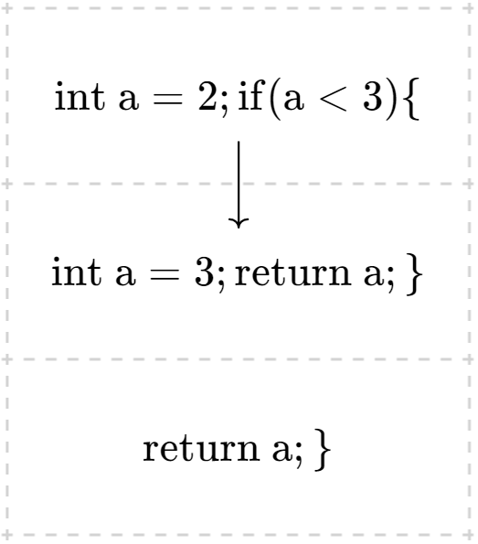

# STAGE3：作用域和循环 实验报告

<center>邢竞择 2020012890</center>

## Step 7

由于在前几个 stage 已经完成了对该功能的支持，所以不需添加任何代码即可通过。

### 思考题



## Step8

### 实验内容

+ 在`parser`阶段添加了`ForStmt,DoWhileStmt`的解析，在`ast`中定义了`ForStmt,DoWhileStmt,ContStmt`节点

+ 在`SemPass1`中添加了`DoWhileStmt,ForStmt`的`visit`函数

  ```cpp
  void SemPass1::visit(ast::DoWhileStmt *s) {
      s->loop_body->accept(this);
      s->condition->accept(this);
  }
  
  void SemPass1::visit(ast::ForStmt *s) {
      Scope *scope = new LocalScope();
      s->ATTR(scope) = scope;
      scopes->open(scope);
      if (s->init != NULL)
          s->init->accept(this);
      if (s->condition != NULL)
          s->condition->accept(this);
      if (s->rear != NULL)
          s->rear->accept(this);
      s->loop_body->accept(this);
      
      scopes->close();
  }
  ```

+ 在`SemPass2`中，添加了`ForStmt,DoWhileStmt`的`visit`函数，需对`cond`进行类型检查

+ 在`translation`中，添加了`ForStmt,DoWhileStmt`的三地址码生成函数。`For`与`DoWhile`不同于`While`，需要三个标签才能完成跳转，以`for`为例

  ```cpp
  void Translation::visit(ast::ForStmt *s) {
      // init...L1..cond..body..L3..rear..L2
      Label L1 = tr->getNewLabel();
      Label L2 = tr->getNewLabel();
      Label L3 = tr->getNewLabel();
  
      Label old_break = current_break_label;
      current_break_label = L2;
      Label old_continue = current_continue_label;
      current_continue_label = L3;
      loop_level++;
  
      if (s->init != NULL)
          s->init->accept(this);
      tr->genMarkLabel(L1);
      if (s->condition != NULL) {
          s->condition->accept(this);
          tr->genJumpOnZero(L2, s->condition->ATTR(val));
      }
      s->loop_body->accept(this);
      tr->genMarkLabel(L3);
      if (s->rear != NULL)
          s->rear->accept(this);
      tr->genJump(L1);
      tr->genMarkLabel(L2);
  
      current_break_label = old_break;
      current_continue_label = old_continue;
      loop_level--;
  }
  ```

+ 在`translation`中，添加了`current_continue_label`，用来记录当前位置若出现和`continue`应当跳转到何处，添加了`loop_level`，用来检查`ContStmt`和`BreakStmt`是否出现在循环外

### 思考题

第二种更好。假设循环会进行多次，那么第二种每次循环只执行`body,cond,bnez`，而第一种则需要执行`cond,beqz,body,br`。第二种相当于把前一次的循环体和后一次的条件接在一起了，所以比较节省，但生成的程序会更长。

